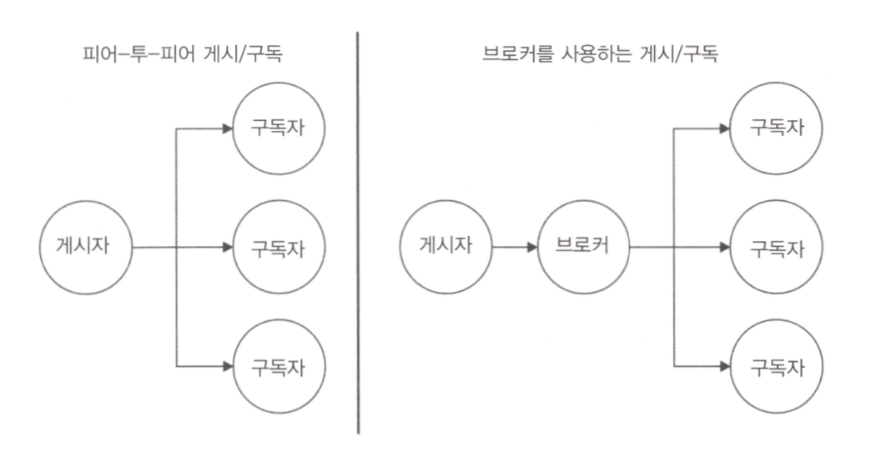
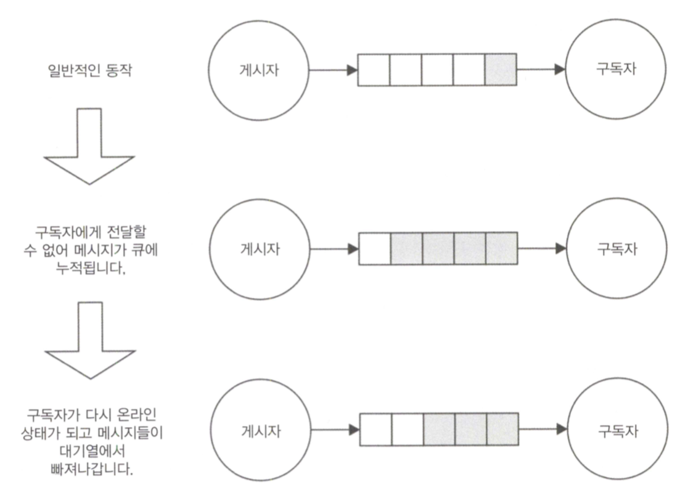
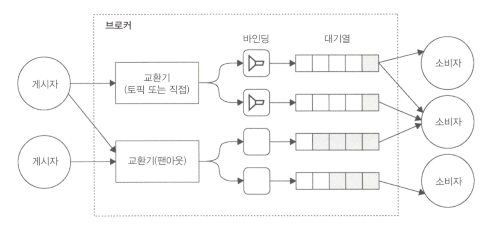
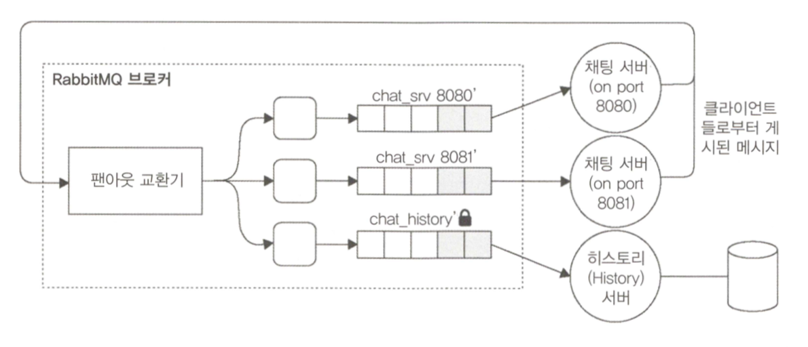
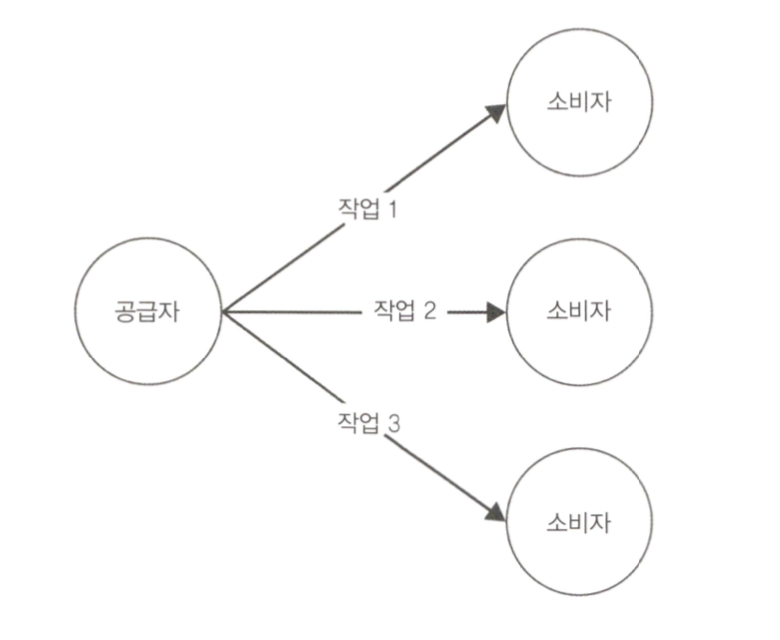
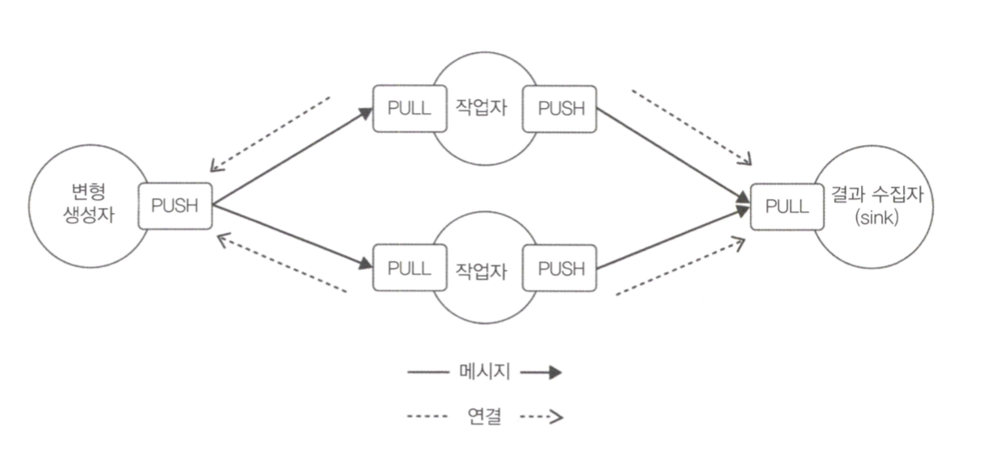
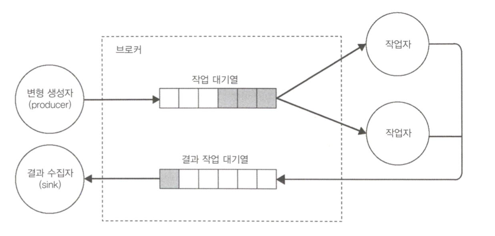
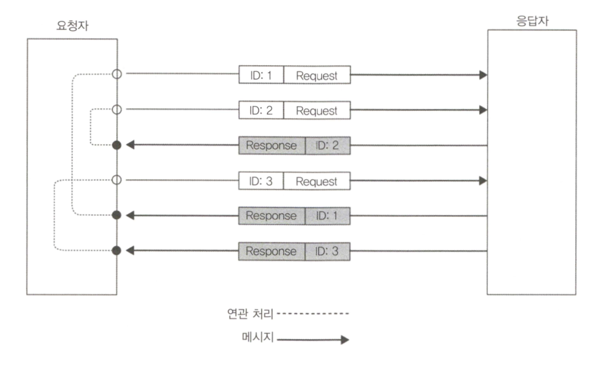
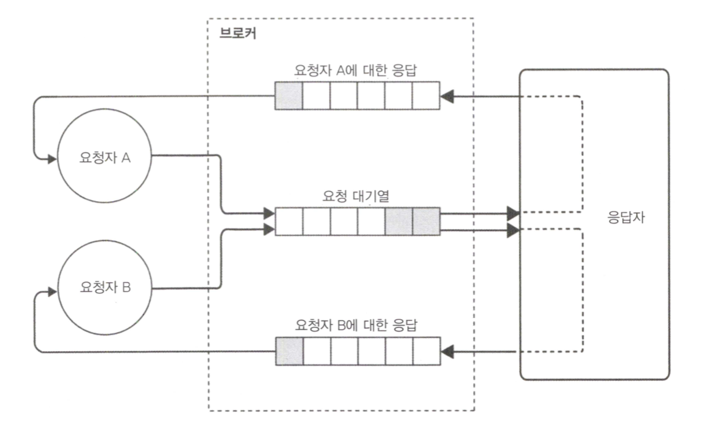

# 11. 메세징과 통합 패턴

여태까지 분할에 대해 알아봤는데, 이번에는 시스템 통합에 관한내용<br />
분산 어플리케이션 통합에는 두 가지 주요 기술이 있는데, `중앙 조정자를 만들어서 모든 정보를 보관하는 것`, `메세지를 사용하여 시스템 전체에 데이터, 이벤트 및 명령을 전파하는 것`<br />
후자를 알아보즈아~<br />
기업 통합 패턴(Enterprise Integration Patterns, GregorHohpe / BobbyWollf 저)에 65가지 바이블이 있으니 참고할 것

- 메시징 시스템의 기본 사항
- 게시(publish)/구독(subscribe) 패턴
- 파이프라인 및 작업 분배 패턴
- 요청(request)/응답(reply) 패턴

## 11-1. 메시징 시스템의 기본 사항

고려해야할 4가지 기본 요소가 있음

1. 단방향 또는 요청/응답 교환할 수 있는 통신의 방향
2. 내용을 결정하는 메시지의 목적
3. 즉시 또는 나중에(비동기식으로) 전송 및 수신할 수 있는 메시지 타이밍
4. 직접 또는 브로커를 통해 발생할 수 있는 메시지의 전달

### 11-1-1. 단방향 및 요청/응답 턴

가장 간단한 통신 패턴은 메시지가 소스 -> 대상으로 단방향 푸쉬(push)되는 경우. 많은 설명이 필요하지 않음

```
________              ________
|      |     push     |       |
| 시작점 | ===========> | 도착점 |
|______|              |_______|
```

단방향 통신의 일반적인 예 : WebSocket을 사용하여 연결된 브라우저에 메시지를 보내거나, 일련의 작업자들에게 작업을 배포하는 시스템

<hr />

그러나 단방향 통신에 비해 웹 서비스 호출같은 요청/응답(양방향) 패턴이 훨씬 인기 있음

```
________              ________
|      |   1.요청      |       |
|      | ===========> | 도착점  |
| 시작점 |   2.응답      |       |
|      | <=========== |       |
|______|              |_______|
```

<hr />

요청/응답 패턴은 구현하기 쉬워보이나, 통신이 비동기이거나 여러 개의 노드가 포함되어 있으면 복잡해짐

```
                  _____________________________________
________          |    ________           ________    |
|      |   1.요청  |    |       |   2.요청  |       |   |
|      | =========|==> |       | ========>|       |   |
|      |          |    |       |          |       |   |
|      |          |    |       |          |       |   |
|      |          |    |_______|          |_______|   |
|      |   3.응답  |                          ||       |
|      | <========|============================       |
|      |          |___________________________________|
________
```

각 노드의 통신 방향은 단방향이나, 전체 관점에서 보면 시작점에서 요청을 보내고 다른 노드에게 응답받음.<br />
실제 요청/응답 패턴과 단방향 순환의 차이점은 요청과 응답의 관계(응답은 요청과 동일한 컨텍스트에서 처리)

### 11-1-2. 메시지 유형

메시지는 다른 소프트웨어 컴포넌트를 연결하는 수단.<br />
메시지 목적에 따라 세가지 유형으로 식별 가능

- 명령 메시지
- 이벤트 메시지
- 도큐먼트 메시지

<b>명령 메시지(Command Message)</b>

6장 디자인 패턴에서 나온 직렬화 된 명령 객체. 수신 측에서 어떤 동작이나 작업을 수행하도록 하는 것.<br />
실행에 주어지는 인자 값 같은 기본적인 정보를 가지고 있어야함. RESTful 호출도 간단한 예

<b>이벤트 메시지(Event Message)</b>

다른 컴포넌트에서 뭔가 발생했음을 알리는데 사용.<br />
브라우저에서 롱 폴링(long polling)이나 WebSocket을 통해 데이터나 시스템이 변화되었을 때 서버로부터 알림받기 / 모든 노드를 동일한 페이지에서 유지할 수 있도록 함(분산 어플리케이션에서 중요한 통합 메커니즘)

<b>도큐먼트 메시지(Document Message)</b>

컴포넌트와 시스템 간의 데이터 전송을 의미. 일반적으로 명령 메시지에 대한 응답에는 요청 데이터 또는 작업의 결과만 포함되므로 도큐먼트 메시지인 경우가 많음(api요청시 json응답)

### 11-1-3. 비동기 메시징 및 큐

동기 - 전화 통화 / 비동기 - SMS<br />
여러 수신자에게 여러 개의 sms를 보내고, 순서와 상관없이 응답 받을 수 있음<br />
또 다른 중요한 이점으로 메시지를 저장한 이후, 일정 지연 후에 전달할 수 있다는 점~ 수신자가 메시지를 처리하기에 바쁘거나 메시지 전달을 보장하고자 할 때 유용


수신 불가시 메시지는 대기열에 쌓이고, 가능해질 때 즉시 발송.<br />

### 11-1-4. 피어 투 피어 또는 브로커 기반 메시징

수신자에게 직접 전달하면 P2P, 중앙 중계 시스템을 이용하면 브로커


P2P에서는 각 노드가 수신자 주소와 포트를 알아야하고 프로토콜, 메시지 형식을 이해하고 있어야함을 의미<br />
반면 브로커는 브리지 역할을 하기 때문에 세부 정보를 알지 못해도 많은 피어(peer)들과 통신<br />

브로커의 단점

- 브로커 장애 터지면 다 노답
- 규모나 처리에 따른 브로커 확장에 대한 부담, 피어 투 피어는 인과관계 있는 애들만 확장하면 됨
- 브로커 없이 메시지를 교환하면 더 빠름

## 11-2. 게시/구독 패턴

잘 알려진 단방향 메시징 패턴 -> 결국 분산된 관찰자 패턴임<br />



게시자는 메시지의 수신자가 누구인지 미리 알 필요가 없는 점이 특별함<br />
게시/구독(pub/sub) 패턴의 양쪽이 느슨하게 결함되어 있어, 진화하는 분산 시스템의 노드를 통합하는데 이상적

### 11-2-1. 간단한 실시간 채팅 어플ㄹ리케이션 만들기

서버 측 구현

```javascript
"use strict";

const WebSocketServer = require("ws").Server;

//static file server
const server = require("http").createServer(
  //[1]
  require("ecstatic")({ root: `${__dirname}/www` })
);

const wss = new WebSocketServer({ server: server }); //[2]
wss.on("connection", ws => {
  console.log("Client connected");
  ws.on("message", msg => {
    //[3]
    console.log(`Message: ${msg}`);
    broadcast(msg);
  });
});

function broadcast(msg) {
  //[4]
  wss.clients.forEach(client => {
    client.send(msg);
  });
}

server.listen(process.argv[2] || 8080);
```

클라이언트 측 구현

```html
<!DOCTYPE html>
<html>
  <head>
    <script>
      var ws = new WebSocket("ws://" + window.document.location.host);
      ws.onmessage = function(message) {
        var msgDiv = document.createElement("div");
        msgDiv.innerHTML = message.data;
        document.getElementById("messages").appendChild(msgDiv);
      };

      function sendMessage() {
        var message = document.getElementById("msgBox").value;
        ws.send(message);
      }
    </script>
  </head>
  <body>
    Messages:
    <div id="messages"></div>
    <input type="text" placeholder="Send a message" id="msgBox" />
    <input type="button" onclick="sendMessage()" value="Send" />
  </body>
</html>
```

여기서 `서로 다른 두 서버`에 연결된 클라이언트가 대화 `메시지를 교환`할 수 있도록 확장하는 것이 목표

### 11-2-2. 메시지 브로커로 Redis 사용하기

Redis는 브로커라기보다는 데이터베이스. 그러나 중앙 집중식 게시/구독 패턴을 구현하도록 설계된 명령 쌍이 존재.<br />
Redis를 메시지 브로커로 사용하여 채팅 서버를 통합해 보즈아~


각 서버는 구독자이면서 게시자.

```javascript
"use strict";

const WebSocketServer = require("ws").Server;
const redis = require("redis"); // [1]
const redisSub = redis.createClient();
const redisPub = redis.createClient();

//static file server
const server = require("http").createServer(
  require("ecstatic")({ root: `${__dirname}/www` })
);

const wss = new WebSocketServer({ server: server });
wss.on("connection", ws => {
  console.log("Client connected");
  ws.on("message", msg => {
    console.log(`Message: ${msg}`);
    redisPub.publish("chat_messages", msg); // [2]
  });
});

redisSub.subscribe("chat_messages"); // [3]
redisSub.on("message", (channel, msg) => {
  wss.clients.forEach(client => {
    client.send(msg);
  });
});

server.listen(process.argv[2] || 8080);
```

1. 두개의 다른 연결(채널 구독/메시지 게시)을 인스턴스화(Redis에서는 연결이 구독자 모드로 설정되면 구독 명령만 사용할 수 있기 때문에 두번째 연결이 필요)
2. 클라이언트에서 새 메시지를 맏으면 chat_message `채널`에 게시. 서버가 동일한 채널에 가입되어 있어서, Redis를 통해 다시 돌아올 것이기 때문에 메시지를 클라이언트에 직접 브로드캐스트 하지 않음.
3. 현재 서버 또는 다른 대화서버에서 게시된 모든 메시지를 수신하도록 리스너 등록. 메시지가 수신되면 모든 클라이언트에 메시지를 브로드 케스트

### 11-2-3. 0MQ(Zero MQ)를 사용한 피어 투 피어 게시/구독

단일 실패 지점이 존재하지 말아야 하는 경우 피어 투 피어가 유리

<b>채팅 서버를 위한 피어-투-피어 아키텍처 설계</b>

0MQ에는 PUB과 SUB 두가지 유형의 소켓이 존재. 일반적인 패턴은 PUB 소켓을 다른 SUB 소켓 수신 포트에 바인딩하는 것.<br />
필터가 존재해서 구독 필터가 적용된 후에만 브로드캐스트 수신.


<b>0MQ PUB/SUB 소켓 사용하기</b>

```javascript
"use strict";

const WebSocketServer = require("ws").Server;
const args = require("minimist")(process.argv.slice(2)); // [1]
const zmq = require("zmq");

//static file server
const server = require("http").createServer(
  require("ecstatic")({ root: `${__dirname}/www` })
);

const pubSocket = zmq.socket("pub"); // [2]
pubSocket.bind(`tcp://127.0.0.1:${args["pub"]}`);

const subSocket = zmq.socket("sub"); // [3]
const subPorts = [].concat(args["sub"]);
subPorts.forEach(p => {
  console.log(`Subscribing to ${p}`);
  subSocket.connect(`tcp://127.0.0.1:${p}`);
});
subSocket.subscribe("chat");

subSocket.on("message", msg => {
  // [5]
  console.log(`From other server: ${msg}`);
  broadcast(msg.toString().split(" ")[1]);
});

const wss = new WebSocketServer({ server: server });
wss.on("connection", ws => {
  console.log("Client connected");
  ws.on("message", msg => {
    // [4]
    console.log(`Message: ${msg}`);
    broadcast(msg);
    pubSocket.send(`chat ${msg}`);
  });
});

function broadcast(msg) {
  wss.clients.forEach(client => {
    client.send(msg);
  });
}

server.listen(args["http"] || 8080);
```

1. 명령어 인자 파싱하기위한 라이브러리
2. PUB 소켓을 만들고 --pub에 해당하는 포트에 바인드
3. SUB 소켓을 만들고 다른 인스턴스의 PUB 소켓에 연결. 'chat' 문자열로 시작되는 메시지만 수신하게 됨
4. WebSocket에서 새 메시지를 받으면 연결된 모든 클라이언트에 브로드캐스트 하지만 PUB 소켓을 통해서도 게시됨.
5. 우리는 SUB 소켓에서 도착하는 메시지를 들음. chat 접두어를 제거한 후 WebSocket 서버에 연결된 모든 클라이언트로 브로드캐스트

```
node app -http 8080 --pub 5000 -sub 5001 --sub 5002
node app -http 8081 --pub 5001 -sub 5000 --sub 5002
node app -http 8082 --pub 5002 -sub 5000 --sub 5001
```

### 11-2-4. 영구 구독자(Durable subscribers)

메시징 시스템에서 중요한 추상화는 메시지 큐(MQ)<br />
메시지 큐의 경우, 대기열 시스템은 수신자가 메시지를 수신할 수 있을 때까지 메시지들을 저장하므로 메시지 발신자와 수신자가 동시에 활성화되고 연결될 필요는 없음.<br />
구독자가 연결된 동안에만 수신할 수 있는 설정후 잊어버리기(set and forget) 패러다임과 반대되는 것.<br />
항상 모든 메시지를 안정적으로 수신할 수 있는 구독자를 `영구 구독자`라고 함.

- 메시지의 서비스 품질(QoS) 레벨

  1. QoS0 최대 한 번: 설정 후 잊어버리기(set and forget). 연결이 끊어진 경우 메시지가 손실될 수 있음
  2. QoS1, 최소 한 번: 메시지가 적어도 한번은 수신되도록 보장되지만, 수신자가 알리기 전에 충돌할 경우 중복 발생 가능
  3. QoS2, 정확히 한 번: 가장 안정적인 QoS. 메시지가 한번만 수신된다는 것을 보장



0MQ는 영구 구독자를 지원할 수 있는 몇가지 패턴을 갖고있지만 구현은 우리에게 달려있음

<b>AMQP 소개</b>

메시지 대기열은 메시지를 분실하면 안되는 은행, 금융 같은 업무가 주로 포함됨. -> 매우 복잡하고 안정성이 보장되어야 하기 때문에 오라클, IBM 같은 애들의 특권(특정 기업에 종속되는 문제)이였는데 AMQP, STOMP, MQTT 같은 개방형 프로토콜의 성장 덕분에 메시징 시스템이 주류에 진입한지 이제 몇 년 지남.<br />

AMQP에는 세 가지 필수 컴포넌트 존재

1. 대기열(Queue): 클라이언트가 사용하는 메시지를 저장하는 데이터 구조. 여러 사용자가 동일한 대기열에 연결되어 있는 경우 메시지는 이들에게 로드 밸런스 됨. 대기열은 아래 중 하나일 수 있음.

- 영구적(Durable) 큐: 브로커가 다시 시작되면 대기열이 자동으로 만들어짐. 실질적으로는 영구적(persistent) 표시된 메시지만 disk에 저장되고 재시작 시 복원
- 독점적(Exclusive) 큐: 큐가 하나의 특정 구독자에게만 바인딩됨을 의미. 연결 종료시 대기열 소멸
- 자동 삭제(Auto-delete) 큐: 마지막 구독자의 연결이 끊어지면 대기열이 삭제

2. 교환기(Exchange): 여기에 메시지가 게시됨. 교환기 실행 알고리즘에 따라 하나 이상의 대기열로 라우팅

- 직접 교환기(Direct Exchange): 전체 라우팅 키(예: chat.msg)를 일치시켜 메시지를 라우팅함.
- 토픽 교환기(Topic exchange): 라우팅 키와 일치하는 glob-like(유닉스 경로 명) 패턴을 사용하여 메시지를 배분(예: chat.#은 chat으로 시작하는 모든 라우팅 키와 일치)
- 팬아웃 교환기(Fanout Exchange): 제공된 모든 라우팅 키를 무시하고 연결된 모든 대기열에 메시지를 브로드캐스트

3. 바인딩(Binding): 교환기와 대기열 간의 연결. 필터링에 사용되는 라우팅 키 또는 패턴 정의



AMQP는 지금까지 본 메시징 시스템보다 훨씬 복잡함. 그러나 기본 게시/구독 메커니즘에서 얻을 수 없는 기능과 신뢰성 제공

<b>AMQP 및 RabbitMQ의 영구 가입자</b>

메시지를 잃지 않는 것이 중요한 전형적인 시나리오는 `마이크로 서비스 아키텍처의 여러 서비스를 동기화 상태로 유지하려는 경우`. 모든 서비스를 동일한 페이지에 보관하려면 정보를 잃지 않는 것이 중요.



팬아웃 교환기 사용 -> 각 채팅 서버 인스턴스에 독점적 대기열 생성(부재중 메시지 수신에는 관심없음, 히스토리 서비스의 역할) -> 히스토리 서비스는 어떤 메시지도 잃어서는 안됨, 히스토리 서비스가 연결 해제된 동안 발생하는 모든 메시지는 대기열에 보관되어 온라인으로 돌아올 때 전달되도록 내구성을 유지해야함

<b>AMQP를 사용하여 신뢰성 있는 히스토리 서비스 구현</b>

```javascript
"use strict";

const level = require("level");
const timestamp = require("monotonic-timestamp");
const JSONStream = require("JSONStream");
const amqp = require("amqplib");
const db = level("./msgHistory");

require("http")
  .createServer((req, res) => {
    res.writeHead(200);
    db.createValueStream()
      .pipe(JSONStream.stringify())
      .pipe(res);
  })
  .listen(8090);

let channel, queue;
amqp
  .connect("amqp://localhost") // [1]
  .then(conn => conn.createChannel())
  .then(ch => {
    channel = ch;
    return channel.assertExchange("chat", "fanout"); // [2]
  })
  .then(() => channel.assertQueue("chat_history")) // [3]
  .then(q => {
    queue = q.queue;
    return channel.bindQueue(queue, "chat"); // [4]
  })
  .then(() => {
    return channel.consume(queue, msg => {
      // [5]
      const content = msg.content.toString();
      console.log(`Saving message: ${content}`);
      db.put(timestamp(), content, err => {
        if (!err) channel.ack(msg);
      });
    });
  })
  .catch(err => console.log(err));
```

1. AMQP 브로커와 연결을 수립
2. chat 팬아웃 교횐기(exchange)를 설정
3. chat_history 대기열 생성
4. 교환기에 대기열을 바인딩
5. 수신한 메시지를 저장 -> 성공적으로 저장된 후에야 메세지를 볼 수 있음 -> 브로커에서 ACK를 받지 못하면 메시지가 다시 처리될 수 있도록 대기열에 보관

## 11-3. 파이프라인 및 작업 배포 패턴

9장 고급 비동기 레시피에서 작업을 여러 로컬 프로세스에 위임하는 방법을 배웠지만, 단일 시스템의 경계를 넘어서는 확장은 불가능
이 섹션에서는 네트워크의 모든 위치에 있는 원격 작업자들을 사용하여 분산형 아키텍처와 유사한 패턴을 사용하는 것이 어떻게 가능한지 알아보즈아~



대신 각 메시지를 다른 소비자에게 보내는 로드 밸런서와 유사한 메시지 배포 패턴<br />
HTTP 로드 밸런서와 다른 중요한 차이점은 소비자 역할이 활발하다는 것. 소비자와 연결되는 것은 생산자가 아니라 `소비자 자신이 새로운 작업을 얻기 위해 생산자나 대기열에 연결`<br />


일반적인 메시징 시스템에서 생산자와 작업자간 요청/응답 통신을 반드시 할 필요는 없기 때문에 `비동기 통신`을 사용하는데, 위 아키텍처처럼 병렬 처리와 확장성이 향상됨(마치 map-reduce 꼴을 보는 느낌)

### 11-3-1. 0MQ 팬아웃/팬인 패턴

이전에 PUB과 SUB으로 단일 메시지를 여러 소비자에게 전달하였는데, 이제 PUSH / PULL이라는 소켓 쌍을 사용하여 병렬 파이프라인을 구축해보즈아~

<b>PUSH/PULL 소켓</b>

직관적으로 PUSH 소켓은 메시지 전송, PULL 소켓은 수신용. 사소해보이지만 단방향 통신 시스템을 구축하기에 이상적인 특징을 가지고 있음

- PUSH 소켓을 만들어 PULL 소켓에서 들어오는 연결을 청취하는 로컬 포트에 바인딩하거나, PULL 소켓에서 PUSH 소켓의 연결을 수신하도록 할 수 있다.
- 하나의 PUSH 소켓에 여러 개의 PULL 소켓이 연결되어 있으면 메시지가 모든 PULL 소켓에 균등하게 배분(실제로는 부하가 분산됨/peer-to-peer load balancing).
- 여러 PUSH에서 메시지를 수신하는 PULL 소켓은 공정한 대기열 시스템을 사용하여 메시지를 처리 -> 인바운드 메시지에 라운드 로빈 적용 -> 모든 메시지들을 균등하게 소비
- 연결된 PULL 소켓이 없는 PUSH 소켓을 통해 전송된 메시지는 사라지지 않음 -> 온라인 상태가 되어 메시지를 가져가기 시작할 때까지 생성자 큐에 대기

<b>0MQ를 사용한 분산된 해시섬 크래커 만들기</b>

brute-force용 파이프라인을 만들어보자



- worker들에게 배포하는 변형 생성자(ventilator)
- 주어진 변형에 대한 해시섬(hashsum)을 계산하고 비교하는 worker
- 일치하는 항목이 존재하면 싱크(sink)에 전송
- 변형 생성자, 결과 수집자(sink)가 영구노드
- worker는 임시 노드

<b>변형 생성자(ventilator) 구현</b>

```javascript
"use strict";

const zmq = require("zmq");
const variationsStream = require("variations-stream");
const alphabet = "abcdefghijklmnopqrstuvwxyz";
const batchSize = 10000;
const maxLength = process.argv[2];
const searchHash = process.argv[3];

const ventilator = zmq.socket("push"); // [1]
ventilator.bindSync("tcp://*:5016");

let batch = [];
variationsStream(alphabet, maxLength)
  .on("data", combination => {
    batch.push(combination);
    if (batch.length === batchSize) {
      // [2]
      const msg = { searchHash: searchHash, variations: batch };
      ventilator.send(JSON.stringify(msg));
      batch = [];
    }
  })
  .on("end", () => {
    //나머지 조합을 전달
    const msg = { searchHash: searchHash, variations: batch };
    ventilator.send(JSON.stringify(msg));
  });
```

1. PUSH 소켓을 만들고 5000 포트에 바인딩. 작업자의 PULL 소켓이 연결되어 작업을 수신
2. 생성된 변형 항목들을 1만개 항목으로 그룹화 한다음, 해시와 단어 묶음이 포함된 메시지를 작성 -> 공급기 소켓을 통해 send()를 호출하면 메시지를 라운드 로빈 방식의 배포에 따라 다음으로 사용 가능한 작업자에게 전달.

<b>작업자(worker) 구현</b>

```javascript
"use strict";

const zmq = require("zmq");
const crypto = require("crypto");
const fromVentilator = zmq.socket("pull");
const toSink = zmq.socket("push");

fromVentilator.connect("tcp://localhost:5016");
toSink.connect("tcp://localhost:5017");

fromVentilator.on("message", buffer => {
  const msg = JSON.parse(buffer);
  const variations = msg.variations;
  variations.forEach(word => {
    console.log(`Processing: ${word}`);
    const shasum = crypto.createHash("sha1");
    shasum.update(word);
    const digest = shasum.digest("hex");
    if (digest === msg.searchHash) {
      console.log(`Found! => ${word}`);
      toSink.send(`Found! ${digest} => ${word}`); // 찾았따!
    }
  });
});
```

- 공급기에 연결되어 작업을 수신하는 PULL 소켓
- 결과를 전달하기 위해 결과 수집자(sink)에 연결되는 PUSH 소켓

<b>결과 수집자(Sink) 구현</b>

```javascript
"use strict";

const zmq = require("zmq");
const sink = zmq.socket("pull");
sink.bindSync("tcp://*:5017");

sink.on("message", buffer => {
  console.log("Message from worker: ", buffer.toString());
});
```

작업자에게서 받은 메시지를 콘솔에 출력

<b>어플리케이션 실행</b>

```
node worker
node worker
node sink
```

```
node ventilator 4 f8e966d1e207d02c44511a58dccff2f5429e9a3b
```

### 11-3-2. AMQP의 파이프라인과 경쟁 소비자

이번에는 브로커를 사용해서 이 패턴을 사용하는 방법을 살펴보자

<b>점대점(point-to-point 통신 및 경쟁 소비자</b>

피어-투-피어 구성에서 파이프라인은 이해하기 직관적인 매우 간단한 개념. 브로커가 중간에 있게 되면 조금 더 어려워짐.<br />
브로커 자체는 통신을 위한 중개자이므로 우리는 누가 메시지를 수신하는지 알지 못함 -> 각 메시지가 오직 한 소비자에만 수신된다는 보장이 없음 -> 교환기를 우회하여 목적지 큐에 직접 메시지를 전송 -> 이 방법을 사용하면 하나의 대기열만 메시지를 수신할 수 있음(점대점 통신 패턴)

<b>AMQP를 사용한 해시 크래커 구현</b>



여러 작업자에게 여러 작업을 배포하려면 단일 대기열을 사용해야함. 각각의 작업자는 큐를 통해 메시지를 수신.<br>
전체 아키텍처에서 우리는 어떠한 교환기도 사용하지 않음<br>
점대점 통신을 구현하여 목적지 대기열로 직접 메시지를 전송

<b>공급자(producer) 구현하기</b>

```javascript
"use strict";

const amqp = require("amqplib");
const variationsStream = require("variations-stream");
const alphabet = "abcdefghijklmnopqrstuvwxyz";
const batchSize = 10000;
const maxLength = process.argv[2];
const searchHash = process.argv[3];

let connection, channel;
amqp
  .connect("amqp://localhost")
  .then(conn => {
    connection = conn;
    return conn.createChannel();
  })
  .then(ch => {
    channel = ch;
    produce();
  })
  .catch(err => console.log(err));

function produce() {
  let batch = [];
  variationsStream(alphabet, maxLength)
    .on("data", combination => {
      batch.push(combination);
      if (batch.length === batchSize) {
        const msg = { searchHash: searchHash, variations: batch };
        channel.sendToQueue("jobs_queue", new Buffer(JSON.stringify(msg)));
        batch = [];
      }
    })
    .on("end", () => {
      //send remaining combinations
      const msg = { searchHash: searchHash, variations: batch };
      channel.sendToQueue(
        "jobs_queue",
        new Buffer(JSON.stringify(msg)),
        //when the last message is sent, close the connection
        //to allow the application to exit
        function() {
          channel.close();
          connection.close();
        }
      );
    });
}
```

어떤 교환기나 바인딩 없이 AMQP 통신을 간단하게 설정. 메시지를 게시하는 것만 관심있기 때문에 대기열도 필요하지 않음<br />
가장 중요한 부분은 channel.sendToQueue() API. 대기열(jobs_queue)에 직접 메시지를 전달하는 역할을 담당. 교환기나 라우팅을 거치지 않음

<b>작업자 구현하기</b>

```javascript
"use strict";

const amqp = require("amqplib");
const crypto = require("crypto");

let channel, queue;
amqp
  .connect("amqp://localhost")
  .then(conn => conn.createChannel())
  .then(ch => {
    channel = ch;
    return channel.assertQueue("jobs_queue");
  })
  .then(q => {
    queue = q.queue;
    consume();
  })
  .catch(err => console.log(err.stack));

function consume() {
  channel.consume(queue, function(msg) {
    const data = JSON.parse(msg.content.toString());
    const variations = data.variations;
    variations.forEach(word => {
      console.log(`Processing: ${word}`);
      const shasum = crypto.createHash("sha1");
      shasum.update(word);
      const digest = shasum.digest("hex");
      if (digest === data.searchHash) {
        console.log(`Found! => ${word}`);
        channel.sendToQueue(
          "results_queue",
          new Buffer(`Found! ${digest} => ${word}`)
        );
      }
    });
    channel.ack(msg);
  });
}
```

jobs_queue가 있는지 확인 후 channel.consume()을 사용하여 들어오는 작업을 기다림. 매칭이 발견될 때마다 다시 점대점 통신으로 results_queue를 통해 수집자에게 결과를 보냄

<b>결과 수집자(result collector) 구현하기</b>

```javascript
"use strict";

const amqp = require("amqplib");

let channel, queue;
amqp
  .connect("amqp://localhost")
  .then(conn => conn.createChannel())
  .then(ch => {
    channel = ch;
    return channel.assertQueue("results_queue");
  })
  .then(q => {
    queue = q.queue;
    channel.consume(queue, msg => {
      console.log("Message from worker: ", msg.content.toString());
    });
  })
  .catch(err => console.log(err.stack));
```

<b>어플리케이션의 실행</b>

```
node worker
node worker
```

```
node collector
node producer 4 f8e966d1e20]d02c44511a58dccff2f5429e9a3b
```

## 11-4. 요청(request)/응답(reply) 패턴

비동기 단방향 채널만 가진 상황에서 요청/응답 방식으로 메시지를 교환하기 위한 추상화 방법을 아는 것이 중요

### 11-4-1. 상관 관계 식별자(correlation identifier)

단방향 채널 위에 요청/응답의 추상화를 만들기 위한 기본적인 블록.<br />
각 요청에 식별자를 표시한 다음, 수신자가 응답할 때 이를 첨부 -> 요청한 발신자가 두 메시지를 연관시키고 응답을 알맞은 핸들러에 반환할 수 있음



ID를 사용하여 각 요청을 보낸다음, 다른 순서로 수신해도 올바르게 일치시키는 방법을 보여줌

<b>요청(request) 추상화하기</b>

```javascript
// request.js
"use strict";

const uuid = require("node-uuid");

module.exports = channel => {
  const idToCallbackMap = {}; // [1]

  channel.on("message", message => {
    // [2]
    const handler = idToCallbackMap[message.inReplyTo];
    if (handler) {
      handler(message.data);
    }
  });

  return function sendRequest(req, callback) {
    // [3]
    const correlationId = uuid.v4();
    idToCallbackMap[correlationId] = callback;
    channel.send({
      type: "request",
      data: req,
      id: correlationId
    });
  };
};
```

1. 요청과 응답 핸들러 간 상호 관계를 저장하는 변수
2. 팩토리가 호출되면 메시지를 기다리기 시작, 메시지의 관계 ID(inReplyto)가 idToCallbackMap의 ID와 일치하면 응답을 받은 것이므로, 메시지에 포함된 데이터를 가지고 호출
3. 새로운 요청을 보내는데 사용할 함수 반환

<b>응답(reply) 추상화하기</b>

```javascript
// reply.js
"use strict";

module.exports = channel => {
  return function registerHandler(handler) {
    channel.on("message", message => {
      if (message.type !== "request") return;
      handler(message.data, reply => {
        channel.send({
          type: "response",
          data: reply,
          inReplyTo: message.id
        });
      });
    });
  };
};
```

1. 들어오는 요청을 수신하고, 메시지를 받으면 데이터와 콜백 함수를 전달하여 핸들러를 즉시 호출 -> 핸들러로부터 응답을 수집
2. 핸들러가 작업을 완료하면 콜백을 호출하여 응답을 반환 -> 관계 ID(inReplyToId)를 첨부하여 채널로 다시 돌려줌

<b>요청/응답 전체 사이클</b>

```javascript
// replier.js
"use strict";

const reply = require("./reply")(process);

reply((req, cb) => {
  setTimeout(() => {
    cb({ sum: req.a + req.b });
  }, req.delay);
});
```

replier는 단순히 두 수의 합을 계산하여 일정 시간 지연 후 결과 반환

```javascript
// requestor.js
"use strict";

const replier = require("child_process").fork(`${__dirname}/replier.js`);
const request = require("./request")(replier);

request({ a: 1, b: 2, delay: 500 }, res => {
  console.log("1 + 2 = ", res.sum);
  //this should be the last reply we receive, so we close the channel
  replier.disconnect();
});

request({ a: 6, b: 1, delay: 100 }, res => {
  console.log("6 + 1 = ", res.sum);
});
```

요청자(requestor)는 응답자(replier)를 사작한 다음, 요청 주상화(request abstraction)에 전달.

### 11-4-2. 반송 주소(return address)

상관 관계 식별자는 단방향 채널 위에 요청/응답 통신을 생성하기 위한 기본적인 패턴.<br />
그러나 둘 이상의 채널 혹은 큐가 있거나 요청자가 둘 이상일 경우에는 이것만으로 충분하지 않음.<br/>
관계 ID 이외에 응답자가 요청의 원래 발신자에게 응답을 보낼 수 있는 정보인 반송 주소도 알아야함

<b>AMQP에서 반송 주소 패턴 구현</b>

AMQP에서 반송 주소는 requestor가 들어오는 응답을 수신 대기하는 대기열. 응답은 하나의 요청자만 수신하기 때문에 대기열은 비공개이고, 서로 다른 소비자 간에는 공유되지 않는 것이 중요



메시지 등록 정보에 응답 대기열의 이름을 지정하면 됨.

<b>요청 추상화 구현</b>

RabbitMQ를 브로커로 사용할 것이지만 AMQP 브로커와 호환된다면 무엇이든 괜춘.<br />
응답을 저장할 큐를 생성하는 방법 `channel.assertQueue('', {exclusive: true});`<br />

```javascript
// amqpRequest.js
"use strict";

const uuid = require("node-uuid");
const amqp = require("amqplib");

class AMQPRequest {
  constructor() {
    this.idToCallbackMap = {};
  }

  initialize() {
    return amqp
      .connect("amqp://localhost")
      .then(conn => conn.createChannel())
      .then(channel => {
        this.channel = channel;
        return channel.assertQueue("", { exclusive: true });
      })
      .then(q => {
        this.replyQueue = q.queue;
        return this._listenForResponses();
      })
      .catch(function(err) {
        console.log(err);
      });
  }

  _listenForResponses() {
    return this.channel.consume(
      this.replyQueue,
      msg => {
        const correlationId = msg.properties.correlationId;
        const handler = this.idToCallbackMap[correlationId];
        if (handler) {
          handler(JSON.parse(msg.content.toString()));
        }
      },
      { noAck: true }
    );
  }

  request(queue, message, callback) {
    const id = uuid.v4();
    this.idToCallbackMap[id] = callback;
    this.channel.sendToQueue(queue, new Buffer(JSON.stringify(message)), {
      correlationId: id,
      replyTo: this.replyQueue
    });
  }
}

module.exports = () => new AMQPRequest();
```

request 메소드는 대기열의 이름, 보낼 메시지를 인자로 사용, 관계 ID를 생성하고 이를 콜백 함수에 연결해야함. correlationId 및 replyTo 속성에 메타 데이터를 정의하여 메시지를 보냄.<br />
Channel.publish() 대신 channel.sendToQueue() API를 사용하여 메시지를 보내눈 부분이 중요. 교환기 사용하지 않고, 목적지 큐로 직접 전달되는 점대점 방식<br />

\_listenForResponse 함수는 메시지를 수신하고, 관계 ID를 읽고 응답 대기 중인 핸들러의 목록과 비교 -> 핸들러가 있으면 응답 메시지를 인자로 핸들러를 호출

<b>응답 추상화 구현</b>

```javascript
// amqpReply.js
"use strict";

const amqp = require("amqplib");

class AMQPReply {
  constructor(qName) {
    this.qName = qName;
  }

  initialize() {
    return amqp
      .connect("amqp://localhost")
      .then(conn => conn.createChannel())
      .then(channel => {
        this.channel = channel;
        return this.channel.assertQueue(this.qName);
      })
      .then(q => (this.queue = q.queue))
      .catch(err => console.log(err.stack));
  }

  handleRequest(handler) {
    return this.channel.consume(this.queue, msg => {
      const content = JSON.parse(msg.content.toString());
      handler(content, reply => {
        this.channel.sendToQueue(
          msg.properties.replyTo,
          new Buffer(JSON.stringify(reply)),
          { correlationId: msg.properties.correlationId }
        );
        this.channel.ack(msg);
      });
    });
  }
}

module.exports = (excName, qName, pattern) => {
  return new AMQPReply(excName, qName, pattern);
};
```

응답을 보낼때 channel.sendToQueue를 사용하여 지정된 대기열에 메시지를 직접 게시<br />

<b>요청자(requestor) 및 응답자(replier) 구현</b>

```javascript
// replier.js
"use strict";

const Reply = require("./amqpReply");
const reply = Reply("requests_queue");

reply.initialize().then(() => {
  reply.handleRequest((req, cb) => {
    console.log("Request received", req);
    cb({ sum: req.a + req.b });
  });
});
```

추상체들을 통해 관계 ID와 반송 주소(return address)를 처리하는 모든 메커니즘을 블랙박스화<br />
나머지는 동일

```javascript
// requestor.js
"use strict";

const req = require("./amqpRequest")();

req.initialize().then(() => {
  for (let i = 100; i > 0; i--) {
    sendRandomRequest();
  }
});

function sendRandomRequest() {
  const a = Math.round(Math.random() * 100);
  const b = Math.round(Math.random() * 100);
  req.request("requests_queue", { a: a, b: b }, res => {
    console.log(`${a} + ${b} = ${res.sum}`);
  });
}
```

```
node replier
node requestor
```

응답자가(replier)가 처음으로 시작되면 영구 큐가 생성됨 -> 응답자의 실행을 중지했다가 응답자를 다시 실행해도 요청이 손실되지 않음 -> 응답자가 다시 시작될 때까지 모든 메세지가 대기열에 저장됨<br />
다른 이점으로, 요청자가 늘어나면 로드 밸런싱 됨. 요청자가 동일한 영구 대기열에 리스너로 연결되기 때문에 브로커는 대기열의 모든 사용자(경쟁 소비자 패턴)에 걸쳐 메시지의 로드 밸런싱을 하게 됨

## 11-5. 요약

AMQP와 메시지 브로커를 사용하여 유지 보수 비용을 줄이면서 안정적이고 `확장 가능한 어플리케이션`을 구현할 수 있음을 확인, 0MQ를 사용하여 제어가능한 `분산 시스템`을 만드는 방법을 살펴봄 -> 분산 처리가 nodejs의 비동기 동작과 잘 어울린다고 생각. 끝!
