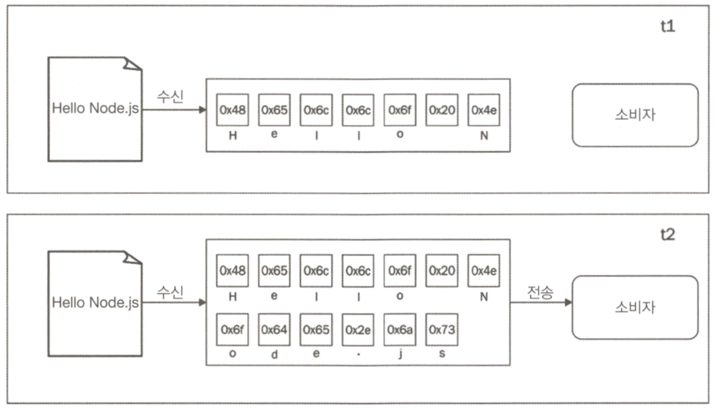
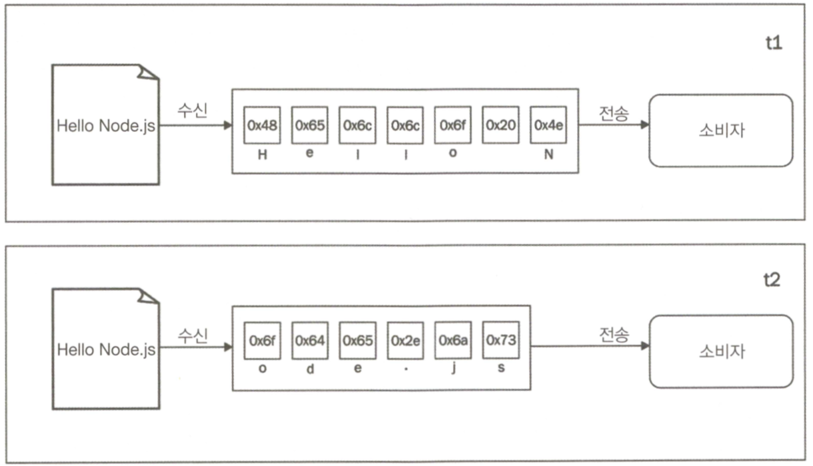

# 05 스트림 코딩

### 스트림의 중요성

- Node.js와 같은 이벤트 기반 플랫폼에서 I/O를 처리하는 가장 효율적인 방법은 실시간으로 가능한 순간 바로 입력을 사용하고 어플리케이션에서 출력이 생성되는 즉시 내보내는 것.

##### 버퍼 vs 스트리밍

- 버퍼


- 스트림


- 버퍼 모드는 리소스로 오는 모든 데이터를 버퍼에 수집했다가 자원을 모두 다 읽어들인 후 콜백에 전달. 반면 스트림은 리소스에서 도착하자마자 데이터를 처리할 수 있다.
- 스트림의 이점은 공간효율성, 시간효율성, 결합성이 있다.

##### 공간효율성

- 스트림은 버퍼링하여 모든 데이터를 한꺼번에 처리하는 방식으로 불가능한 작업을 처리할 수 있음.

- 버퍼링된 API를 사용한 Gzipping(압축)

``` javascript

const fs = require('fs');
const zlib = require('zlib');

const file = process.argv[2];

fs.readFile(file, (err, buffer) => {
    zlib.gzip(buffer, (err, buffer) => {
        fs.writeFile(file + '.gz', buffer, err => {
            console.log(File successfully compressed);
        });
    });
});

```

- 아주 큰 파일을 선택한다면(1GB 보다 더 큰 파일) 파일이 허용된 최대 버퍼의 크기보다 크다는 오류 발생.
> RangeError: File size is greater than possible Buffer: 0x3FFFFFFF bytes


- 스트림을 사용한 Gzipping(압축)

``` javascript

const fs = require('fs');
const zlib = require('zlib');
const file = process.argv[2];

fs.createReadStream(file)
  .pipe(zlib.createGzip())
  .pipe(fs.createWriteStream(file + '.gz'))
  .on('finish', () => console.log(File successfully compressed));

```

- 모든 크기의 파일에 대해 프로그램이 이상적으로 일정한 메모리 사용률을 가지고 실행됨.

##### 시간효율성

- 파일을 압축하고 원격의 HTTP 서버에 업로드하는 어플리케이션의 경우 -> 클라이언트 시스템에서 스트림을 사용하면 파일 시스템에서 데이터 덩어리를 읽는 즉시 압축하고 보낼 수 있다.

```javascript

// gzipReceive.js (서버 측)

const http = require('http');
const fs = require('fs');
const zlib = require('zlib');

const server = http.createServer((req, res) => {
    const filename = req.headers.filename;
    console.log('File request received: ' + filename);
req
  .pipe(zlib.createGunzip())
  .pipe(fs.createWriteStream(filename))
  .on('finish', () => {
    res.writeHead(201, {'Content-Type': 'text/plain'});
    res.end('That`s it\n');
    console.log(`File saved: ${filename}`);
  });
});

server.listen(3000, () => console.log('Listening'));

```

```javascript

// gzipSend.js (클라이언트 측)

const fs = require('fs');
const zlib = require('zlib');
const http = require('http');
const path = require('path');
const file = process.argv[2];
const server = process.argv[3];

const options = {
    hostname: server,
    port: 3000,
    path: '/',
    method: 'PUT',
    headers: {
        filename: path.basename(file),
        'Content-Type': 'application/octet-stream',
        'Content-Encoding': 'gzip'
    }
};

const req = http.request(options, res => {
    console.log('Server response: ' + res.statusCode);
});

fs.createReadStream(file)
  .pipe(zlib.createGzip())
  .pipe(req)
  .on('finish', () => {
    console.log('File successfully sent');
  });

```


- 스트림을 사용하면 이전 작업들이 완료될 때까지 기다릴 필요가 없고, 우리가 실행하는 각 작업이 비동기적이면서 Node.js에 의해 병렬로 실행될 수 있기 때문에 완벽하게 작동함.

##### 결합성

- 앞에 작성한 gzipReceive/gzipSend 어플리케이션에 암호화 계층을 추가

```javascript

const crypto = require('crypto');
//...
fs.createReadStream(file)
  .pipe(zlib.createGzip())
  .pipe(crypto.createCipher('aes192', 'a_shared_secret'))
  .pipe(req)
  .on('finish', () => console.log('File succesfully sent'));

```

```javascript

const crypto = require('crypto');
//...
const server = http.createServer((req, res) => {
    //...
    req
       .pipe(crypto.createDecipher('aes192', 'a_shared_secret'))
       .pipe(zlib.createGunzip())
       .pipe(fs.createWriteStream(filename))
       .on('finish', () => {/* ... */});
});

```

- 큰 수고 없이 어플리케이션에 암호화 레이어를 추가함. 이미 존재하는 파이프라인에 변환 스트림을 끼워 넣어 스트림을 재사용함. 비슷한 방법으로, 레고 블록처럼 다른 스트림을 추가하여 결합가능.
- 스트림을 사용하면 더 깨끗하고 모듈화된 코드를 만들 수 있음.


### 스트림 시작하기

- Node.js의 핵심 모듈을 비롯한 모든 곳에서 사용된다.

##### 스트림의 구조

- Node.js에서 모든 스트림은 스트림의 코어 모듈에서 사용할 수 있는 네 가지 추상 클래스 중 하나의 구현체
    * stream.Readable
    * stream.Writable
    * stream.Duplex
    * stream.Transform

- 각 스트림 클래스는 EventEmitter의 인스턴스이기도 하다. 실제로 스트림은 Readable 스트림에서 읽기가 끝났을 때 발생하는 end, 무엇인가 잘못되었을 때 발생하는 error와 같은 여러 가지 유형의 이벤트를 제공한다.
- 스트림이 매우 유연한 이유 중 하나는 바이너리 데이터를 처리할 뿐만 아니라 거의 모든 JavaScript의 값을 처리할 수 있다는 것.

##### Readable 스트림

- non-flowing 모드 : 새로운 데이터를 읽을 준비가 되었다는 신호인 readable 이벤트에 대하여 listener를 등록하는 것. 명시적으로 데이터를 가져올 수 있고, 데이터는 readable 리스너에서 독점적으로 읽을 수 있음.

```javascript

process.stdin
    .on('readable', () => {
        let chunk;
        console.log('New data available');
        while((chunk = process.stdin.read()) != null) {
            console.log(
                `Chunk read: (${chunk.length}) "${chunk.toString()}"`
            );
        }
    })
    .on('end', () => process.stdout.write('End of stream'));
    
```


- flowing 모드 : data 이벤트에 리스너를 등록하는 것. read()를 사용하여 꺼내지 않고 데이터가 도착하자마자 해당 리스너에 전달됨.

```javascript

process.stdin
    .on('data', chunk => {
        console.log('New data available');
        console.log(
            `Chunk read: (${chunk.length}) "${chunk.toString()}"`
        );
        
    })
    .on('end', () => process.stdout.write('End of stream'));
    
```

###### Readable 스트림 구현하기

- stream.Readable의 prototype을 상속 받아 _read() 메소드 구현

```javascript

const stream = require('stream');
const Chance = require('chance');
const chance = new Chance();

class RandomStream extends stream.Readable {
    constuctor(options){
        super(options);
    }
    
    _read(size) {
        const chunk = chance.string();
        console.log(`Pushing chunck of size: ${chunk.length}`);
        this.push(chunk, 'utf8');
        if(chance.bool({likelihood: 5})) {
            this.push(null);
        }
    }
}

module.exports = RandomStream;

```

```javascript

const RandomStream = require('./randomStream');
const randomStream = new RandomStream();

randomStream.on('readable', () => {
    let chunk;
    while((chunk = randomStream.read()) !== null) {
        console.log(`Chunk received: ${chunk.toString()}`);
    }
});

```

##### Writable 스트림

- Writable 스트림은 데이터의 목적지를 나타냄.

>writable.write(chunk, [encoding], [callback])

- 더 이상 스트림에 기록할 데이터가 없다는 신호를 보내기 위해서는 end() 메소드를 사용.
>writable.end(chunk, [encoding], [callback])

- end()메소드의 콜백 함수는 모든 데이터가 하위 리소스로 플러시 되었을 때 발생하는 finish 이벤트에 리스터를 등록하는 것과 같다.

```javascript

const Chance = require('chance');
const chance = new Chance();

require('http').createSever((req, res) => {
    res.writeHead(200, {'Content-Type': 'text/plain'});
    while(chance.bool({likelihood: 95})) {
        res.write(chance.string() + '\n');
    }
    res.end('\nThe end...\n');
    res.on('finish', () => console.log('All data was sent'));
}).listen(8080, () => console.log('Listening on http://localhost:8080'));

```

###### 백프레셔

- 실제 파이프 시스템에서 흐르는 액체와 마찬가지로 Node.js 스트림은 스트림이 소비하는 것보다 더 빠르게 데이터를 쓸경우 병목 현상이 발생할 수 있다.
- Writable 스트림은 highWaterMark라는 속성을 가지고 있는데 이것은 내부 버퍼의 크기 제한을 나타낸다.
- write() 메소드가 false를 반환하면 어플리케이션에서는 더 이상의 데이터를 쓰지 말아야하고, 버퍼가 비워지면 drain 이벤트가 발생하여 다시 쓰기를 시작해도 좋다는 것을 알린다.
- 이 메커니즘을 백프레셔라고 한다.

```javascript

const Chance = require('chance');
const chance = new Chance();

require('http').createServer((req, res) => {
    res.writeHead(200, {'Content-Type': 'text/plain'});
    
    function generateMore() {
        while(chance.bool({likelihood: 95})) {
            let shouldContinue = res.write(
                chance.string({length: (16 * 1024) -1})
            );
            
            if(!shouldContinue) {
                console.log('Backpressure');
                return res.once('drain', generateMore);
            }
        }
        res.end('\nThe end...\n',() => console.log('All data was sent'));        
    }
    generateMore();
}).listen(8080, () => console.log('Listening on http://localhost:8080'));


```

- Writable 스트림 구현

```javascript

const stream = require('stream');
const fs = require('fs');
const path = require('path');
const mkdirp = require('mkdirp');
class ToFileStream extends stream.Writable {
    constructor() {
        super({objectMode: true});
    }
    
    _write (chunk, encoding, callback) {
        mkdirp(path.dirname(chunk.path), err => {
            if(err) {
                return callback(err);
            }
            fs.writeFile(chunk.path, chunk.content, callback);
        });
    }
}
module.exports = ToFileStream;

```

```javascript

const ToFileStream = require('./toFileStream.js');
const tfs = new ToFileStream();

tfs.write({path: "file1.txt", content: "Hello"});
tfs.write({path: "file2.txt", content: "Node.js"});
tfs.write({path: "file3.txt", content: "Streams"});
tfs.end(() => console.log("All files created"));

```

##### Duplex 스트림

- 양방향 스트림은 Readable과 Writable 모두가 가능한 스트림이다. 소켓처럼 데이터 소스와 데이터 목적지를 모두 가지는 항목을 다룰 때 유용함.
- _read() 및 _write() 메소드 구현,

##### Transform 스트림

- 데이터 변환을 처리하도록 설계된 특별한 종류의 이중 스트림


```javascript

const stream = require('stream');
const util = require('util');

class ReplaceStream extends stream.Transform {
    constructor(searchString, replaceString) {
        super();
        this.searchString = searchString;
        this.replaceString = replaceString;
        this.tailPiece = '';
    }
    
    _transform(chunk, encoding, callback) {
        const pieces = (this.tailPiece + chunk)
            .split(this.searchString);
        const lastPiece = pieces[pieces.length - 1];
        const tailPieceLen = this.searchString.length - 1;
        
        this.tailPiece = lastPiece.slice(-tailPieceLen);
        pieces[pieces.length - 1] = lastPiece.slice(0,-tailPieceLen);
        
        this.push(pieces.join(this.replaceString));
        callback();
    }
    
    _flush(callback) {
        this.push(this.tailPiece);
        callback();
    }
}

module.exports = ReplaceStream;

```

```javascript

const ReplaceStream = require('./replaceStream');

const rs = new ReplaceStream('World', 'Node.js');
rs.on('data', chunk => console.log(chunk.toString()));

rs.write('Hello W');
rs.write('orld!');
rs.end();

// Hel
// lo Node.js
// !

```

### 스트림을 사용한 비동기 제어 흐름

##### 순차실행

- 기본적으로 스트림은 순차적으로 데이터를 처리

```javascript

const fromArray = require('from2-array');
const through = require('through2');
const fs = require('fs');

function concatFiles(destination, files, callback) {
    const destStream = fs.createWriteStream(destination);
    fromArray.obj(files)
        .pipe(throught.obj((file, enc, done) => {
            const src = fs.createReadStream(file);
            src.pipe(destStream, {end: false});
            src.on('end', done)
        }))
        .on('finish', () => {
            destStream.end();
            callback();
        });
}
module.exports = concatFiles;

```

```javascript

const concatFiles = require('./concatFiles');
concatFiles(process.argv[2], process.argv.alice(3), () => {
    console.log('Files concatenated successfully');
});    

```
- 스트림 작업 또는 스트림 조합을 이용하여 일련의 비동기 작업을 순차적으로 쉽게 반복할 수 있음.

##### 비순차 병렬 실행

- 때때로 Node.js 동시성을 최대한 활용하지 못하기 때문에 병목 현상이 있을 수 있다.
- 모든 데이터 덩어리들에 대해 느린 비동기 작업을 실행해야 하는 경우, 실행을 병렬화하고 전체 프로세스의 속도를 높이는 것이 유리하다.
- 병렬 스트림은 데이터가 처리되는 순서가 중요한 경우에는 사용할 수 없다.

```javascript

const stream = require('stream');

class ParallelStream extends stream.Transform {
    constructor(userTransform) {
        super({objectMode: true});
        this.userTransform = userTransform;
        this.running = 0;
        this.terminateCallback = null;
    }
    
    _transform(chunk, enc, done) {
        this.running++;
        this.userTransform(chunk, enc, this.push.bind(this),
        this._onComplete.bind(this));
        done();
    }
    
    _flush(done) {
        if(this.running>0) {
            this.terminateCallback = done;
        } else {
            done();
        }
    }
    
    _onComplete(err) {
        this.running--;
        if(err) {
            return this.emit('error', err);
        }
        if(this.running === 0) {
            this.terminateCallback && this.terminateCallback();
        }
    }
}

module.exports = ParallelStream;

```


