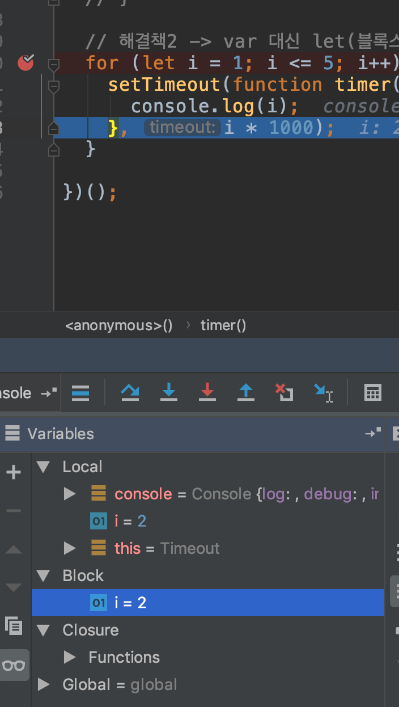

# 주요 개념 및 내용
클로저란 내부 함수의 스코프가 아직 죽지 않고 살아있는 상태!  
즉 외부에서 내부를 호출 할 수 있음! 왜냐 안죽었으니깐... 난무적이다.  
`모듈화`의 근간이 되는 개념

**외부에서 내부함수를 호출 -> 즉 조건은 외부에서 내부의 참조값을 들고 있으면 그 스코프가 사라지지 않음 -> 이게 핵심**

`쿨로저는 객체든 원시값이든 외부에서 내부를 참조하고 있으면 성립된다`. -> **토론 1,2**


## 스코프가 사라지지 않는 이유

```javascript
// 핵심개념
// 1번째
  function foo() {
    var a = 2;

    function bar() {
      console.log(a); // 2
    }

    return bar; // 함수 자체 반환
  }

  var bar = foo();  // function bar(){...}

  // foo의 내부 함수 실행 (함수반환)
  // 사라지지 않는 이유 -> bar가 반환된 후 스코프를 잡고 있어서 (클로저 핵심)
  bar();  // 클로저 -> foo 스코프가 살아 있는 상태 -> a 값을 세팅하는 이유


  // 2번째
  function foo2() {
    var a = 3;

    function baz() {
      console.log(a); // 3
    }

    bar2(baz);
  }

  function bar2(fn) {
    // 최종적으로 여기서 fn(baz)가 실행됨
    // baz 는 foo2의 내부함수! 클로저 -> foo2의 스코프를 잡고 있음 foo2의 gc가 안이루어짐
    fn(); // 클로저
  }

  foo2(); // 3


  // 3번째
  console.log("클로저 3번째 내용");
  var fn3;

  function foo3() {
    var a = 4;

    function baz3() {
      console.log(a);
    }

    fn3 = baz3;
  }

  function bar3() {
    fn3();  // 클로저 : 여기서 fn3 = baz3 (foo3 내부함수 참조함)
  }

  foo3(); // 이거주석하면 (TypeError: fn3 is not a function) -> 이유는 fn3 할당이안되서!

  bar3();
```

## 토론

```javascript
// 1번째 토론
  console.log("=== 타이머 활용===")
  function wait(message) {
    setTimeout(function timer() {
      // 1초후 실행되는 이유는??
      // timer를 참조하는 setTimerout의 내부에 fn으로 매핑되는 인자가 있을것이다
      // 그놈이 timer를 잡고 있다
      // 클로저는 message 이녀석의 참조값에 의해 wait가 살아 있게된다.. 일단 추측
     console.log(message);
    }, 1000);
  }

  wait("hello, closure"); // message="hello, closure" 얘가 클로저로 잡히네..?

  // 2번째 토론
  // 클로저 찾기, timer 콜백 실행?
  for (var i = 1; i <= 5; i++) {
    setTimeout(function timer() {
      console.log(i); // 6만 5번출려되는데...
    }, i*1000); // 클로저 찾기
  }
  // 2번 토론에 대해 해결책1

```

### 해결책 2번 참고



## 테스트 코드
```javascript
(function () {


  // 1번째
  function foo() {
    var a = 2;

    function bar() {
      console.log(a); // 2
    }

    return bar; // 함수 자체 반환
  }

  var bar = foo();  // function bar(){...}

  // foo의 내부 함수 실행 (함수반환)
  // 사라지지 않는 이유 -> bar가 반환된 후 스코프를 잡고 있어서 (클로저 핵심)
  bar();  // 클로저 -> foo 스코프가 살아 있는 상태 -> a 값을 세팅하는 이유


  // 2번째
  function foo2() {
    var a = 3;

    function baz() {
      console.log(a); // 3
    }

    bar2(baz);
  }

  function bar2(fn) {
    // 최종적으로 여기서 fn(baz)가 실행됨
    // baz 는 foo2의 내부함수! 클로저 -> foo2의 스코프를 잡고 있음 foo2의 gc가 안이루어짐
    fn(); // 클로저
  }

  foo2(); // 3


  // 3번째
  console.log("클로저 3번째 내용");
  var fn3;

  function foo3() {
    var a = 4;

    function baz3() {
      console.log(a);
    }

    fn3 = baz3;
  }

  function bar3() {
    fn3();  // 클로저 : 여기서 fn3 = baz3 (foo3 내부함수 참조함)
  }

  foo3(); // 이거주석하면 (TypeError: fn3 is not a function) -> 이유는 fn3 할당이안되서!

  bar3();

  // 4번째 토론필요
  console.log("=== 타이머 활용===")

  function wait(message) {
    setTimeout(function timer() {
      // 1초후 실행되는 이유는??
      // timer를 참조하는 setTimerout의 내부에 fn으로 매핑되는 인자가 있을것이다
      // 그놈이 timer를 잡고 있다
      // 클로저는 message 이녀석의 참조값에 의해 wait가 살아 있게된다.. 일단 추측
      console.log(message);
    }, 1000);
  }

  // wait("hello, closure"); // message="hello, closure" 얘가 클로저로 잡히네..?

  // 5번째 토론
  // 클로저 찾기, timer 콜백 실행?
  // for (var i = 1; i <= 5; i++) {
  //   setTimeout(function timer() {
  //     console.log(i); // 6만 5번출려되는데...
  //   }, i * 1000); // 클로저 찾기 i : 6
  // }


  // 해결책1 -> 스스로 생각해보기
  // for (var i = 1; i <= 5; i++) {
  //
  //   // 즉시실행 -> i가 잡고 있는 스코프를 바로 닫는거임
  //   (function (j) {
  //     setTimeout(function timer() {
  //       console.log(j); // 6만 5번출려되는데...
  //     }, j * 1000); // 클로저 찾기 i : 6)
  //   })(i);
  // }

  // 해결책2 -> var 대신 let(블록스코프)
  for (let i = 1; i <= 5; i++) {
    setTimeout(function timer() {
      console.log(i);
    }, i * 1000);
  }

})();
```