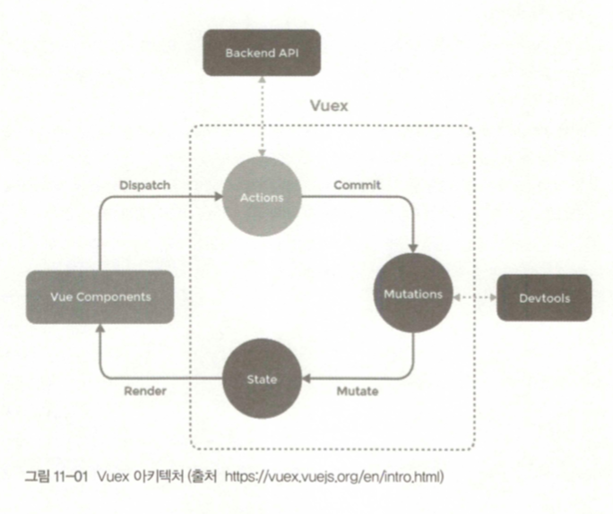
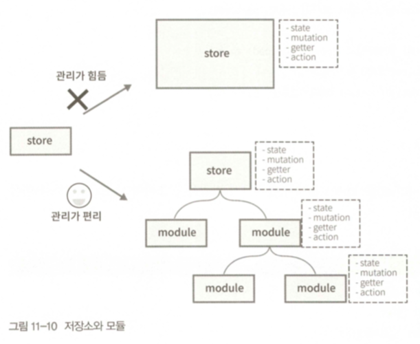

# 11장 Vuex

## Vuex란
* Vue.js 애플리케이션에서 상태 관리 패턴을 지원하는 라이브러리
* 애플리케이션 내부의 모든 컴포넌트들이 공유하는 중앙집중화된 상태 정보 저장소 역할을 하며 상태 변경을 투명하게 할 수 있다.
* 각 컴포넌트가 공유하는 상태 데이터는 전역에서 관리한다.
* 부모에서 자식으로 또 그 자식으로 props를 이용해 속성을 계속해서 전달하지 않아도 되며, 상태 데이터를 변경하기 위해 부모 컴포넌트로 이벤트를 발생시키지 않아도 된다.


## 상태와 변이
* 상태: 애플리케이션의 데이터
* 변이: 상태를 변경하는 함수들을 보유하고 있는 객체
* 전역에서 Vue.use(Vuex) 코드의 실행으로 app 내부의 모든 컴포넌트가 저장소의 상태, 변이 객체에 접근할 수 있다.

```javascript
// src/store/index.js - 데이터 및 뮤테이션 정의
import Vue from 'vue';
import Vuex from 'vuex';
import Constant from '../constant';
Vue.use(Vuex);

const store = new Vuex.Store({
    state: {
        todolist : [
            { todo : "영화보기", done:false },
            { todo : "주말 산책", done:true },
            { todo : "ES6 학습", done:false },
            { todo : "잠실 야구장", done:false }
        ]
    },
    mutations: {
        [Constant.ADD_TODO] : (state, payload) => {
            if (payload.todo !== "") {
                state.todolist.push({ todo : payload.todo, done:false });
            }
        },
        [Constant.DONE_TOGGLE] : (state, payload) => {
            state.todolist[payload.index].done = !state.todolist[payload.index].done;
        },
        [Constant.DELETE_TODO] : (state,payload) => {
            state.todolist.splice(payload.index,1);
        }
    }
})
export default store;

// src/constant.js - 뮤테이션 상수 정의
export default {
    ADD_TODO : "addTodo",
    DONE_TOGGLE : "doneToggle",
    DELETE_TODO : "deleteTodo"
}
```

* 상태는 반드시 변이를 통해서만 변경하도록 해야한다. 그래야먄 상태의 변경 내역을 Vue devtools를 통해 추적할 수 있다.

* 기존 EventBus 방식과의 차이점

```javascript
// src/components/List.vue
<style>
</style>
<template>
    <ul id="todolist">
        <li v-for="(a, index) in todolist" v-bind:class="checked(a.done)"
            v-on:click="doneToggle(index)">
            <span>{{ a.todo }}</span>
            <span v-if="a.done"> (완료)</span>
            <span class="close" v-on:click.stop="deleteTodo(index)">&#x00D7;</span>
        </li>
    </ul>
</template>
<script type="text/javascript">
/*
import eventBus from './EventBus.vue'
export default {
    created : function() {
         eventBus.$on('add-todo', this.addTodo);
    },
    data : function() {
        return {
            todolist : [
                { todo : "영화보기", done:false },
                { todo : "주말 산책", done:true },
                { todo : "ES6 학습", done:false },
                { todo : "잠실 야구장", done:false },
            ]
        }
    },
    methods : {
        checked : function(done) {
            if(done) return { checked:true };
            else return { checked:false };
        },
        addTodo : function(todo) {
            if (todo !== "") {
                this.todolist.push({ todo : todo, done:false });
            }
        },
        doneToggle : function(index) {
            this.todolist[index].done = !this.todolist[index].done;
        },
        deleteTodo : function(index) {
            this.todolist.splice(index,1);
        }
    }
}
*/

import Constant from '../constant'
import { mapState, mapMutations } from 'vuex'
import _ from 'lodash';
export default {
    computed : mapState({
        todolist : (state)=> state.todolist
    }),
    methods : _.extend({
            checked : function(done) {
                if(done) return { checked:true };
                else return { checked:false };
            }
        },
        mapMutations({
            deleteTodo : Constant.DELETE_TODO ,
            doneToggle : Constant.DONE_TOGGLE
        })
    )
}
</script>
```
```javascript
// src/components/inputTodo.vue
<style>
</style>
<template>
    <div>
        <input class="input" type="text" id="task" v-model.trim="todo" 
            placeholder="입력 후 엔터!" v-on:keyup.enter="addTodo">
        <span class="addbutton" v-on:click="addTodo">추 가</span>
    </div>    
</template>
<script type="text/javascript">
// import eventBus from './EventBus.vue'
import Constant from '../constant'

export default {
    name : 'input-todo',
    data : function() {
        return { todo : "" }
    },
    methods : {
        addTodo : function() {
            // eventBus.$emit('add-todo', this.todo);
            this.$store.commit(Constant.ADD_TODO, { todo: this.todo });
            this.todo = "";
        }
    }
}
</script>
```

## 게터
* 저장소(Store) 수준의 계산형 속성(Computed Property)
* 필수 값은 아니지만 적절하게 사용하면 컴포넌트에서의 코드 작성이 편리해진다.

```javascript
// src/store/index.js
import Vue from 'vue';
import Vuex from 'vuex';
import Constant from '../Constant';
import _ from 'lodash';

Vue.use(Vuex);

const store = new Vuex.Store({
    state: {
        currentRegion : "all",
        countries : [
            { no:1,  name : "미국", capital : "워싱턴DC", region:"america" }
   	    ]
    },
    getters : {
        countriesByRegion(state) {
            if (state.currentRegion == "all") {
                return state.countries;
            } else {
                return state.countries.filter(c => c.region==state.currentRegion);
            }
        },
        regions(state) {
            var temp = state.countries.map((c)=>c.region);
            temp = _.uniq(temp);
            temp.splice(0,0, "all");
            return temp;
        },
        currentRegion(state) {
            return state.currentRegion;
        } 
    }, 
    mutations: {
        [Constant.CHANGE_REGION] : (state, payload) => {
            state.currentRegion = payload.region;
        }
    }
})

export default store;
```

```javascript
// src/main.js
import Vue from 'vue'
import App from './App.vue'
import store from './store'

new Vue({
  store,
  el: '#app',
  render: h => h(App)
})
```

```javascript
// src/components/RegionsButtons.vue
<template>
    <div>
        <button class="region" v-for="region in regions" 
            v-bind:class="isSelected(region)"
            @click="changeRegion({region:region})">
            {{region}}
        </button>
    </div>
</template>

<script>
import Constant from '../Constant'
import _ from 'lodash';
import { mapGetters, mapMutations } from 'vuex'
export default {
    name : "RegionButtons",
    computed : {
        regions() {
            return this.$store.getters.regions;
        },
        currentRegion() {
            return this.$store.getters.currentRegion;
        }
    },
    methods : _.extend(
        {
            isSelected(region) {
                if (region == this.currentRegion)  return { selected: true };
                else return { selected:false }
            }
        },
        mapMutations([ 
            Constant.CHANGE_REGION 
        ])
    )
}
</script>
```

## 액션
* 변이는 동기적인 작업만 수행함 --> 비동기 처리는 액션으로 해결한다.
```javascript
// src/store/index.js
import Vue from 'vue';
import Vuex from 'vuex';
import Constant from '../constant';
Vue.use(Vuex);

const store = new Vuex.Store({
    state: {
    },
    mutations: {
    },
    actions : {
        [Constant.ADD_TODO] : ({ state, commit }, payload) => {
            console.log("###addTodo!!!");
            console.log(state);
            commit(Constant.ADD_TODO, payload);
        },
        [Constant.DELETE_TODO] : (store, payload) => {
            console.log("###deleteTodo!!!");
            store.commit(Constant.DELETE_TODO, payload);
        },
        [Constant.DONE_TOGGLE] : (store, payload) => {
            console.log("###doneToggle!!!");
            store.commit(Constant.DONE_TOGGLE, payload);
        }
    }

})

export default store;
```
```javascript
// src/components/inputTodo.vue
<script type="text/javascript">
import Constant from '../constant'
export default {
    name : 'input-todo',
    data : function() {
        return { todo : "" }
    },
    methods : {
        addTodo : function() {
            this.$store.dispatch(Constant.ADD_TODO, { todo: this.todo });
            this.todo = "";
        }
    }
}
</script>
```

* 비동기 처리
```javascript
// src/store/index.js
import Vue from 'vue';
import Vuex from 'vuex';
import Constant from '../constant';
import SearchApi from '../api/SearchAPI';

Vue.use(Vuex);

const store = new Vuex.Store({
    state: {
        contacts : []
    },
    mutations: {
        [Constant.SEARCH_CONTACT] : (state, payload) => {
            state.contacts = payload.contacts;
        }
    },
    actions : {
        async [Constant.SEARCH_CONTACT](store, payload) {
            var response = await SearchApi.searchContact(payload.name);
            store.commit(Constant.SEARCH_CONTACT, { contacts: response.data })
        }
        // [Constant.SEARCH_CONTACT] : (store, payload)=> {
        //     SearchApi.searchContact(payload.name)
        //     .then((response)=> {
        //         store.commit(Constant.SEARCH_CONTACT, { contacts: response.data })
        //     })
        // }
    }
})

export default store;
```

## 대규모 애플리케이션의 저장소 파일
### 역할별 분리
* 각 기능들을 따로 구현하여 index에 합쳐준다.

```javascript
// src/store/index.js
import Vue from 'vue';
import Vuex from 'vuex';
import state from './state.js';
import mutations from './mutations.js';
import actions from './actions.js';
import ES6Promise from 'es6-promise';

ES6Promise.polyfill();
Vue.use(Vuex);

const store = new Vuex.Store({
    state,
    mutations,
    actions
})

export default store;
```

### 모듈 이용하기
* 여러 개의 모듈로 나누어 관리


```javascript
// src/store/module1

import Constant from '../constant';
import SearchApi from '../api/SearchAPI';

export default {
    state: {
        contacts : []
    },
    mutations: {
        [Constant.SEARCH_CONTACT] : (state, payload) => {
            state.contacts = payload.contacts;
        }
    },
    actions : {
        [Constant.SEARCH_CONTACT] : (store, payload)=> {
            SearchApi.searchContact(payload.name)
            .then((response)=> {
                store.commit(Constant.SEARCH_CONTACT, { contacts: response.data })
                if (response.data.length > 0)
                    store.dispatch(Constant.ADD_KEYWORD, payload);
            })
        }
    }
}
```
```
// src/store/index.js
import Vue from 'vue';
import Vuex from 'vuex';
import Constant from '../constant';
import module1 from './module1'

Vue.use(Vuex);

const store = new Vuex.Store({
    state: {
        keywordlist : []
    },
    mutations: {
        [Constant.ADD_KEYWORD] : (state, payload) => {
            state.keywordlist.splice(0, 0, payload.name);
        }
    },
    actions : {
        [Constant.ADD_KEYWORD] : (store, payload)=> {
            store.commit(Constant.ADD_KEYWORD, payload);
        }        
    },
    modules : { m1 : module1 }
})

export default store;
```

